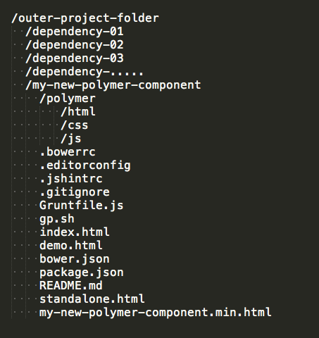

generator-fin-polymer
================

This generator creates a seed polymer project with a minimal grunt server.  The project was originally derived from the polymer groups cannonical seed structure but has drifted from that recently.

This generator launches a livereload connect process to view the docs AND your element demo page.  The element components can be found in a polymer subdirectory, from there all pieces are found in either js, css, or html folders. 

This generator assumes the polymer-project custom component project structure, meaning you need a contain folder to hold dependency projects alonside this project.  The structure should like this

----

to setup a new project with this yo generator, 
  *create holding directory
  *cd into it
  *yo fin-polymer
  *answer 3 questions 
  *cd into project-name
  *sudo npm install // because of wct-test
  *grunt serve
-------

grunt will auto create main element if they don't exist
will create/delete html/css/test files based on js file existence

*create new polymer element with grunt polymer:piece-name
*after you've pushed to git the first time you can update the github pages with ./gp.sh

it will update core-element-page docs

grunt will auto vulcanize
see standalone.html to use the vulcanized min.html file
